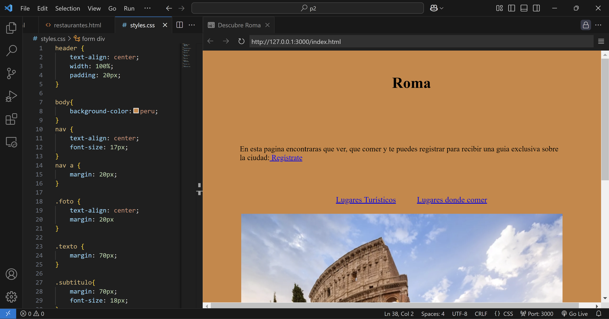

# Practica 2

##[Visita mi página](https://miguelnrs.github.io/p2/)

Toda la practica la he desarrollado directamente en el Visual studio y despues la he subido al github una vez finalizada.
Ademas dentro de VS he instalado la extension "Live preview" para poder ver en directo como quedaban los cambios que hacia en el html:

